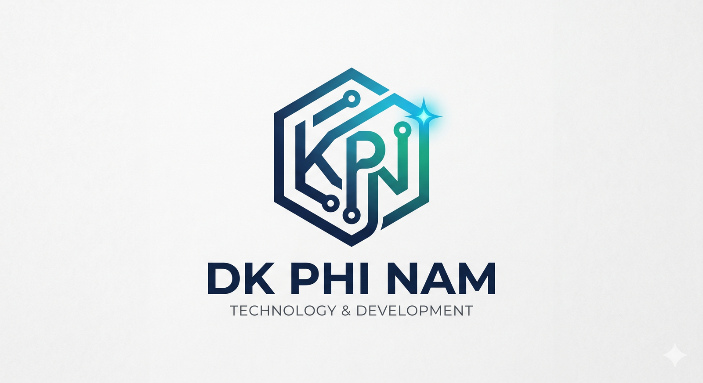

  

  

<!-- Social & Contact Badges -->

  
  &#8287;&#8287;
  
  &#8287;&#8287;
  

<!-- Stats Badges -->

  
  
  
  

 

---

## 👨‍💻 Về Tôi (About Me)

- 🔭 Hiện đang tập trung phát triển các ứng dụng di động đa nền tảng với **Flutter & Dart** và hệ thống web với **Laravel, PHP, JavaScript**.
- 💡 Đam mê khám phá các giải pháp công nghệ mới, ứng dụng **AI** và xây dựng trải nghiệm người dùng hiện đại, mượt mà.
- 📦 Tác giả của hơn **70+ repositories** mã nguồn mở đa dạng từ mobile, web, game HTML5 đến các bot tự động hóa.
- 📫 Kết nối với mình qua [Facebook](https://www.facebook.com/phinam.2004/) hoặc ghé thăm trang web cá nhân [dkphinam.com](https://dkphinam.com).

 

  
<h2>📱 Dự Án Nổi Bật (Featured Projects)</h2>

  

    
    
    
    
    
    
    
    
  

  

    
  

 

  
<h2>🛠️ Kỹ Năng & Công Nghệ (Tech Stack)</h2>

  <h3>📱 Lập Trình Di Động (Mobile Development)</h3>
  

    
    
    
  

  <h3>🌐 Web & Backend Development</h3>
  

    
    
    
    
    
    
    
  

  <h3>🗄️ Cơ Sở Dữ Liệu & Cloud</h3>
  

    
    
    
  

  <h3>💻 Công Cụ & Môi Trường Phát Triển</h3>
  

    
    
    
    
    
  

 

  
<h2>📊 Thống Kê & Hoạt Động (GitHub Stats)</h2>

  

    
    
  

  

    
  

  

    
  

 

  

  ⭐️ Thiết kế & Tối ưu bởi <b>Lê Phi Nam (DK Phi Nam)</b> • Cập nhật tự động 2026

